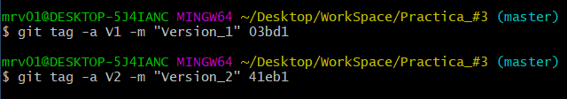

# Prática_#3:
---
Primero haciendo uso del comando ```git log --oneline --all``` listamos todos nuestros commits, una vez que estemos seguros de que tenemos 3, procedemos a realizar la práctica.

---
# Comando ```git tag``` :

El comando ```git tag``` nos permite poner etiquetas a nuestros commits



En este caso etiquetamos nuestro primer commit como V1 usando la propiedad ```-a``` y colocamos un mensaje con la propiedad ```-m "..."```, seguido de esto colocamos el hash del commit que queremos etiquetar.De igual modo procedemos a etiquetar nuestro commit 3 como V2.


```No etiquetamos el segundo commit```

---
### Utilizamos el comando ```git log --oneline --all```


De esta forma observamos que hemos etiquetado nuestros commits de forma correcta.

---
### Si hemos cometido algun error en el proceso de etiquetado :
Podemos utilizar el comando ```git tag -d nombre_de_la_etiqueta```


Una vez eliminada la etiqueta , utilizamos el comando ```git tag -a nombre_de_la_etiqueta - m " mensaje" hash_del_commit``, es decir, realizamos el procedimiento anteriormente explicado.

---
# Comando ```git checkout nombre_de_la_etiqueta```

Podemos utilizar el comando ```git checkout ``` y en vez de utilizar el hash del commit podemos hacer uso del nombre de la etiqueta del commit al que deseamos movernos.


---
# Examinando cambios de un commit con respecto al anterior utilizando el comando ```git show hash_del_commit``` o ```git show nombre_de_la_etiqueta```:


En este caso podemos observar que en la versión 2 se agregaron dos líneas
una con texto y otra que fue un salto de línea

### En mi caso quise revisar los cambios del último commit con respecto al segundo


Donde se observa que solo se añadió una línea.


# Examinando cambios de un commit respecto a sus antecesores utilizando el comando ```git diff commit1..commit3```


Es aconsejable primero poner el commit más antiguo y luego el más moderno.
Si cambiamos el orden nos saldría como algo que borramos, es decir, en color rojo.

Podemos observar las líneas agregadas desde el commit 1 hasta el commit 3, en este caso 3.

# Diferencia entre git show y git diff:

Teniendo en cuenta el resultado anterior , a continuación ejecutamos el comando ```git show commit1..commit3```


Luego podemos arribar a la conclusión de que el comando ```git diff``` muestra todos los cambios realizados de un commit hasta otro commit de forma centralizada, todo lo contrario al comando ```git show```, este muestra comparaciones de un commit con el anterior así sucesivamente dificultando la lectura de la información.
